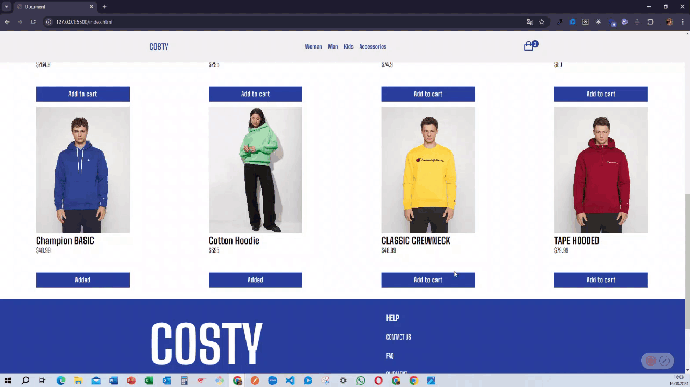

<h1>E-commerce Project </h1>

Bu depo, bir responsive yapıda geliştirilmiş e-ticaret platformu projesi içermektedir. Proje, kullanıcılara ürünleri listeleyip satın alma, sepet yönetimi, kullanıcı hesapları ve yönetim paneli gibi temel e-ticaret özelliklerini sunmayı amaçlamaktadır. 

<h1>Kullanılan Teknolojiler </h1>

- HTML5  

- CSS  

- JavaScript  

<h1>Ekran Görüntüsü </h1>

